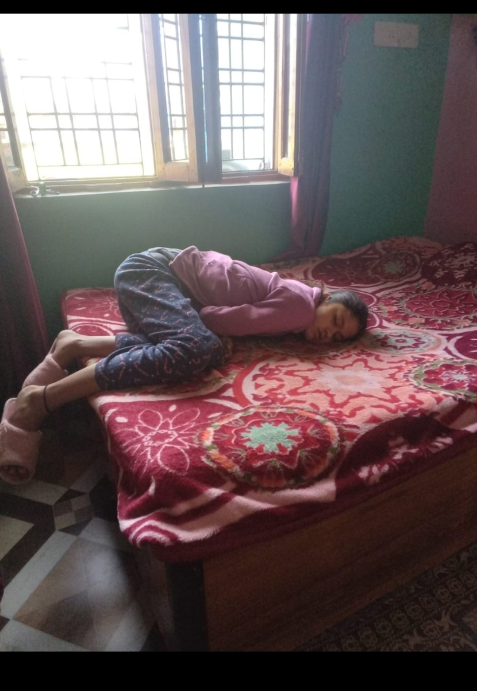
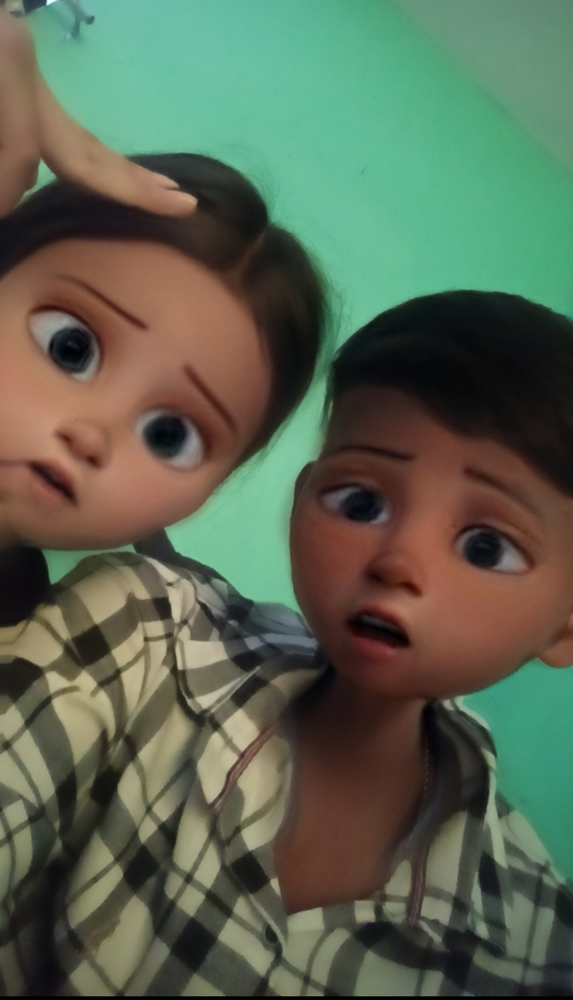
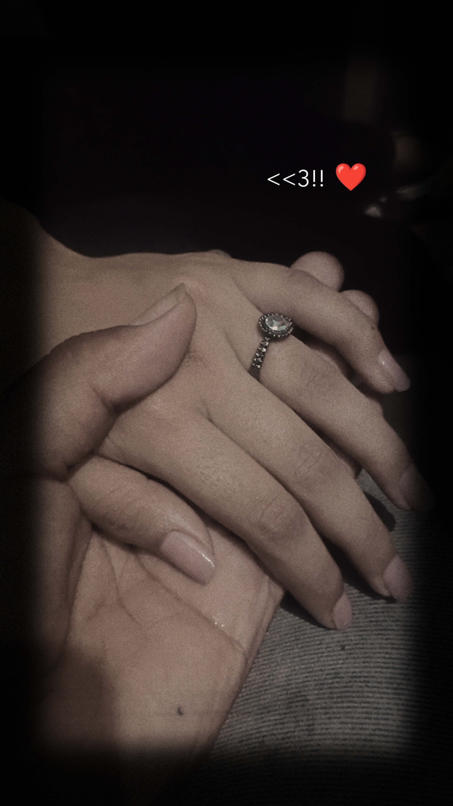
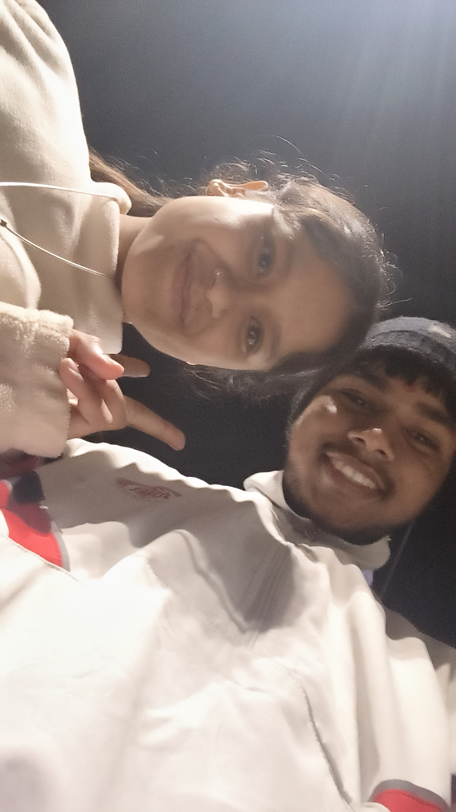

<!DOCTYPE html>
<html>
<head>
<meta charset="UTF-8">
<title>tiya ❤️</title>

</head>

<body>

<!-- PAGE 1 -->

  

  

    
kuttiii

    
Since 01 March 2023 ❤️
    yo are my valentine to tu na ni bol skti 
 
    <button id="yes" onclick="goPage(2)">YES 💍</button>
    <button id="no">NO 😭</button>
  

<!-- PAGE 2 -->

  

    <h2 id="rTitle"></h2> 
    

    <input id="answer" placeholder="Type your answer…">
      
    <button style="background:#ff4d88;color:white" onclick="nextRiddle()">Next ❤️</button>
  

<!-- PAGE 3 -->

  <h2>Our Love in Frames ❤️</h2>
  

    
    
    
    
  

  

    chotu don jii  
    Tum meri life ka sabse soft aur strong hissa ho.  
    Tumhare saath har memory ek blessing lagti hai.  
    I don’t need perfect days —  
    I just need you in all my days ❤️
    the best part of my life ki tera mere sath hona
    Tere nakhre uthane me bhi maja ata 😂😋
Or jab tu gusse me Hoti tbh to aye hayee 🥹😚 maja ata teko dekhne me 
Kbhi bhi to tu bht hala krti pr maja ata 😁😁
Tere sath bitaye har movement kushi ladhi ruthna manana sab best hai 😚😚
Teri chudel wali harkate sali pagal si 
Kbhi kbhi sochta hu ki
Agr hum sath ni hote to kay hota hum dono pagalo ka 😂
Tu to sudhri rhti 😂
Kair xod na hu n me tere sath to ni sochna esa 
Dono  pagal ek jese hai 😚
36 ke 36 gudh mile hai syed hamare bhi 🤭🤭
But thank you soo much for everything 🤭🩷👥
Cudel si dayan 
Teri bachi wali harkate sab se best pagl si 🤭😚kutti kamini 
Notanki baj khi ki 🤭🤭
  

<!-- PAGE 4 -->

  
  

  <button id="slideBtn" onclick="toggleSlideshow()">Pause ⏸️</button>
  <button onclick="goPage(3)" style="background:#ff4d88;color:white">Back ❤️</button>

</body>
</html>
